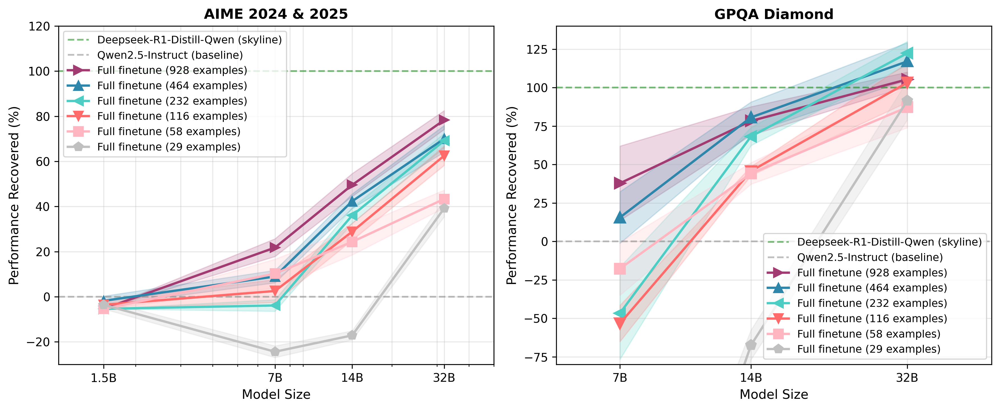

# Scale-Dependent Elicitation of Reasoning in LLMs

This repository contains code for the paper "Scale-Dependent Elicitation of Reasoning in LLMs".



## Installation

1. Clone the repository with submodules:
```bash
git clone --recurse-submodules https://github.com/jnward/scale-dependant-elicitation.git
cd scale-dependant-elicitation
```

2. Install Python dependencies:
```bash
pip install -r requirements.txt
```

3. Install the lm-evaluation-harness:
```bash
cd lm-evaluation-harness
pip install -e .[vllm,math]
cd ..
```

**Note:** Do not install the lm-evaluation-harness located in `s1_peft/eval/` - use the one in the root directory.

## Running the Pipeline

### 1. Training

First, train full model fine-tunes:
```bash
bash 0_train/0.0_train_full_sft.sh
```

Then train LoRA models:
```bash
bash 0_train/0.1_train_loras.sh
```

### 2. Evaluation

Run all evaluations (no LLM judge or API keys required):
```bash
bash 1_eval/1.0_run_all_evals.sh
```

### 3. Analysis and Plotting

Generate plots and analyze results:
```bash
bash 1_eval/1.1_analyze_new_results.sh
```

The plots will be saved in the `1_eval/plots/` directory.